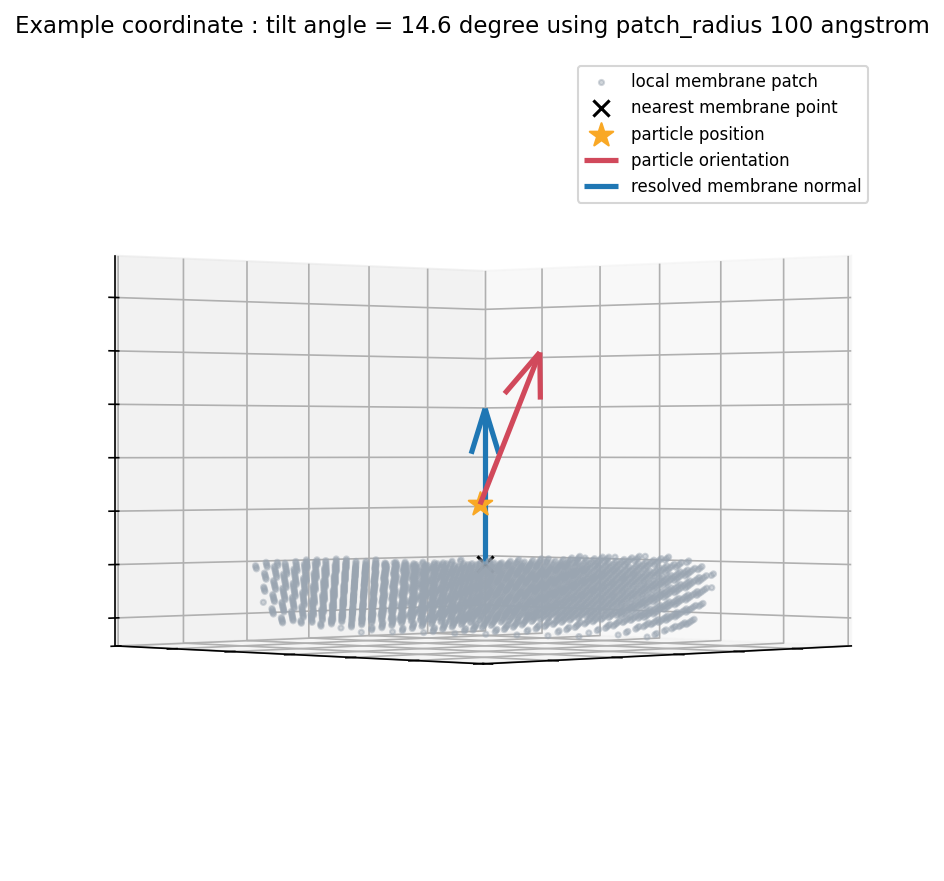

# GTA: Glycoprotein Tilt Analysis

A command-line tool for calculating the tilt angle of viral surface glycoproteins
relative to an irregularly segmented membrane, from a RELION-style STAR file of
particle coordinates/orientations and a segmentation volume.

For each particle it finds the nearest point on the segmented membrane, fits a
local plane to estimate the membrane normal there, and measures the angle
between that normal and the particle's own orientation.



## Installation

```bash
pip install -e .
```

This installs the `gta` command and its dependencies (`typer`, `mrcfile`, `starfile`, `numpy`, `scipy`, `pandas`).

## Usage

```bash
gta segmentation.mrc particles.star -11-seg_apx 7.456 --particles_apx 3.728
```

`seg_file` and `star_file` are positional; pixel sizes are required since the
segmentation and particle coordinates are often binned differently. Everything
else has a sensible default.

### Key options

| Option | Default | What it does |
|---|---|---|
| `--adaptive-patch-radius` / `--no-adaptive-patch-radius` | on | Per-particle: search for the smallest patch radius at which the tilt angle has settled, instead of using one fixed radius for everyone. |
| `--min-patch-radius`, `--max-patch-radius` | 40, 150 Å | Search range used when adaptive selection is on. |
| `--patch_radius` | 150 Å | Fixed patch radius, used only with `--no-adaptive-patch-radius`. |
| `--distance-to-membrane-threshold` | 85 Å | Particles farther than this from any segmented membrane are flagged as implausible picks (roughly the expected ectodomain height). |
| `--angular-gap-threshold` | 40° | Particles whose local patch has a wide empty angular sector (segmentation edge, missing-wedge dropout) are flagged as unreliable. |
| `--output` / `-o` | `tilts_output.star` | Output path. |

Run `gta --help` for the full list.

## Output

Two STAR files are written:

- `<output>.star` — every input particle, with four new columns:
  - `rlnMembraneTiltAngle` — the result, in degrees. `NaN` for particles excluded by the distance or angular-gap checks.
  - `rlnMembraneCurvature` — sign/size of the local membrane curvature relative to the particle (negative = convex/expected, positive = concave, i.e. the particle appears to sit inside the membrane rather than on it).
  - `rlnAngularCoverageGap` — widest empty angular sector (degrees) found around the particle's patch, recorded even for excluded particles so it's clear why.
  - `rlnPatchRadiusUsed` — the patch radius (Å) actually used for that particle.
- `<output>_accepted_coordinates.star` — the same, with excluded (`NaN`) particles dropped, ready to load directly into tools like ArtiaX that can't filter on `NaN`.

## Example

The image above is particle from a real tomogram (shown here at a fixed
100 Å patch radius for a clearer view of the membrane; the tool's own adaptive
selection would typically use a smaller radius for this particle), viewed
side-on to the fitted normal: the grey cloud is its local membrane patch, the
black cross is the nearest membrane point, the blue arrow is the fitted
membrane normal, and the red arrow is the particle's own orientation — the
angle between them (here, 14.6°) is what gets reported. 
